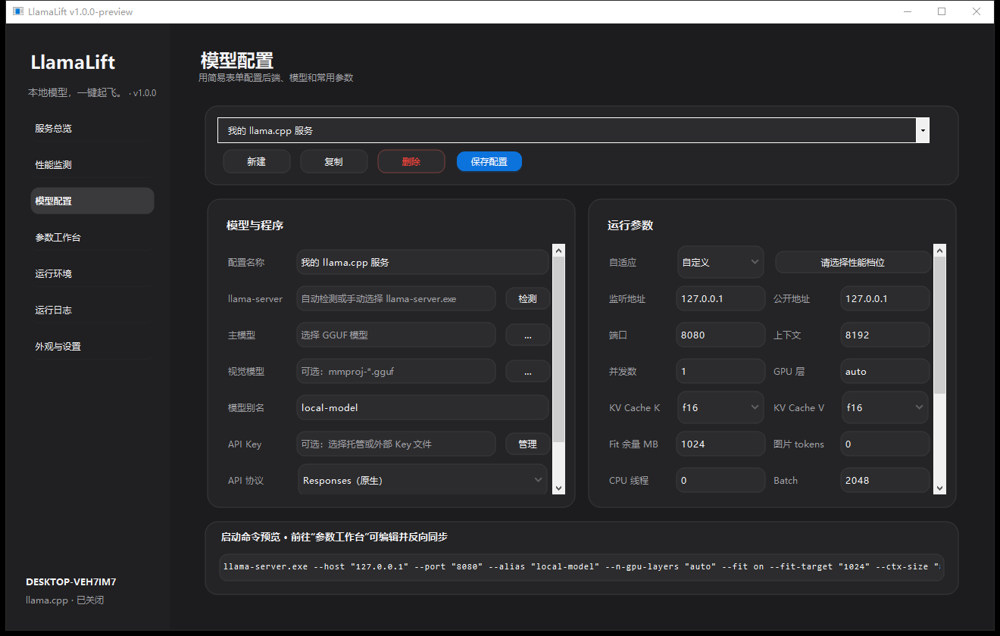
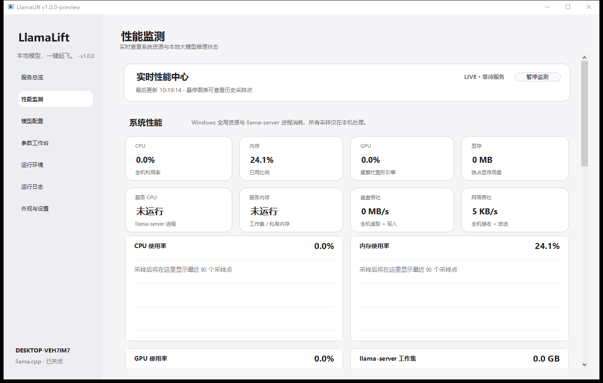

<div align="center">

# LlamaLift

### 本地模型，一键起飞。

面向 Windows 的 llama.cpp 桌面控制中心。<br>
从运行时安装、硬件识别和自适应调参，到服务管理、性能监测与 API 接入，都在一个界面完成。

[](https://github.com/rankeend/llama-cpp-windows-launcher/releases/tag/v1.0.0-preview)


**[下载 v1.0 Preview](https://github.com/rankeend/llama-cpp-windows-launcher/releases/tag/v1.0.0-preview)** · [快速开始](#快速开始) · [查看更新](CHANGELOG.md) · [内测清单](docs/INTERNAL-TESTING-v1.0-preview.md)

> 当前为最后一个私有内测预览版本。下一阶段将进入公开测试。

</div>

---

## 不再为启动一个本地模型反复试参数

运行 llama.cpp 往往不只是选择一个 GGUF：你还需要找到合适的 Windows 构建，判断 CUDA、Vulkan 或 CPU 后端，估算上下文和 KV Cache，占用端口，维护启动命令，再从日志里确认模型究竟是在加载还是已经退出。

LlamaLift 把这条链路整理成一个可见、可保存、可验证的工作流：

**检测硬件 → 安装运行时 → 选择模型 → 生成参数 → 启动服务 → 监测推理 → 接入客户端**

它不会取代 llama.cpp，也不会把模型上传到云端。LlamaLift 是运行在本机的控制层，负责把常见操作做得更明确，同时保留进阶用户对完整命令的控制权。

## 产品预览

### 模型、程序与运行参数分区管理

独立滚动区域、快速/均衡/极限三档自适应方案，以及可随模型保存的 API 协议偏好。



### 系统与模型性能放在同一个实时面板

同时观察 CPU、内存、GPU、显存、磁盘、网络、llama-server 进程、生成速度、并发、槽位和上下文占用。



## 核心能力

| 能力 | LlamaLift 做什么 | 带来的价值 |
| --- | --- | --- |
| llama.cpp 运行时管理 | 从 ggml-org/llama.cpp 官方 Release 获取 Windows x64 构建，支持 CPU、CUDA、Vulkan、SYCL 与 HIP；CUDA 资产会匹配同版本 cudart | 不必手工翻找压缩包、组合依赖和维护多个目录 |
| 本机自动发现 | 搜索已登记运行时、现有配置、PATH、应用数据目录和常见安装位置；识别结果先由用户确认 | 已有 llama.cpp 可以直接复用，识别不准时仍可选择目录或 EXE |
| 硬件与 GGUF 识别 | 读取 CPU、内存、GPU、显存，以及 GGUF 架构、上下文、层数、GQA 和量化信息 | 调参基于本机与模型信息，而不是照搬别人的启动命令 |
| 三档自适应参数 | 快速、均衡、极限目标分别面向响应速度、日常稳定和资源上限；生成上下文、GPU 层、KV Cache、线程和 Batch 建议 | 新用户可以从可解释的方案起步，所有结果仍可手工修改 |
| 参数工作台 | 编辑完整 llama-server 命令，解析后反向同步表单；未知参数原样保留 | 进阶参数不会因为切回图形界面而丢失 |
| 非阻断式启动预检 | 保存前检查引号、路径、端口、参数组合、内存风险和鉴权配置，并给出修改建议 | 尽早发现明显错误，但最终决定权仍在用户手里 |
| 服务生命周期 | 管理启动、长时间加载、停止、重启、端口释放、异常退出和外部服务 | 减少残留进程、端口冲突和“界面显示已停但进程仍在”的情况 |
| 实时性能中心 | 监测系统资源与 llama.cpp `/metrics`、`/slots` 数据，展示最近 90 个采样点 | 不用在任务管理器、终端日志和监控脚本之间来回切换 |
| API Key 管理 | 创建、生成、导入、脱敏查看和选择本地 Key 文件；新 Key 使用 `sk-llamalift-<64 位十六进制>` | 密钥不必写进 BAT，日志也不会记录明文 |
| 双主题与高 DPI | Apple 式克制信息层级，完整浅色/深色主题，Per-Monitor V2 DPI | 在 940×600 到 200% 缩放下保持清晰、可滚动和可操作 |

## API 协议

协议选择决定 LlamaLift 展示和测试的客户端接入方式，**不会修改 llama-server 启动命令**。同一个新版 llama.cpp 服务可以同时开放多类兼容端点；实际能力取决于所安装的上游版本，可使用“测试全部”逐项确认。

| 选择项 | Base URL 示例 | 请求端点 | 鉴权头 |
| --- | --- | --- | --- |
| Responses | `http://127.0.0.1:8080/v1` | `/v1/responses` | `Authorization: Bearer <key>` |
| Chat Completions | `http://127.0.0.1:8080/v1` | `/v1/chat/completions` | `Authorization: Bearer <key>` |
| Anthropic Messages | `http://127.0.0.1:8080` | `/v1/messages` | `x-api-key: <key>` |

接口定义以 [llama.cpp HTTP Server 官方文档](https://github.com/ggml-org/llama.cpp/blob/master/tools/server/README.md) 为准。

## 快速开始

### 1. 下载

从 [v1.0.0-preview Release](https://github.com/rankeend/llama-cpp-windows-launcher/releases/tag/v1.0.0-preview) 获取：

- `LlamaLift-v1.0.0-preview-Setup.exe`：安装版。
- `LlamaLift-v1.0.0-preview-portable-win-x64.zip`：解压即用的便携版。
- `LlamaLift-v1.0.0-preview-SHA256SUMS.txt`：发布文件校验值。

> 当前构建尚未进行 Authenticode 数字签名，Windows SmartScreen 可能显示“未知发布者”。请只从本仓库 Release 下载，并核对 SHA-256。

### 2. 准备运行环境

打开“运行环境”，检测本机硬件并刷新官方版本。选择推荐的 llama.cpp 构建后下载并安装；如果电脑上已经存在 `llama-server.exe`，也可以让 LlamaLift 自动发现或手工选择。

### 3. 启动模型

在“模型配置”中选择 GGUF，按需求选择快速、均衡或极限方案，确认参数后保存并启动服务。启动大型模型时，状态会区分“正在加载”“已就绪”“输出中”和“异常”，不会因为固定的短超时自动终止加载。

### 4. 接入客户端

选择客户端需要的 API 协议，复制页面显示的 Base URL，随后执行“测试当前”或“测试全部”。API 请求中的 `model` 值应与配置中的模型别名一致。

## 安全与隐私边界

- 新配置默认监听 `127.0.0.1`，不会自动向局域网开放。
- 程序不会上传模型、提示词、API Key 或性能采样数据，也不会修改 Windows 防火墙和系统代理。
- API Key 保存在本地文本文件中，界面默认脱敏；启动日志会隐藏内联密钥。
- 监听地址改为 `0.0.0.0` 时，界面会提示网络风险。此时应限制防火墙来源并启用鉴权。
- llama.cpp 运行时只从 GitHub 官方 HTTPS 地址下载；安装前检查 ZIP 路径穿越，并在上游提供摘要时执行 SHA-256 校验。
- 删除 LlamaLift 中的模型配置不会删除 GGUF、mmproj 或 llama.cpp 文件。

## 已验证范围

v1.0 Preview 在发布前通过：

- **106 项离线检查**：覆盖配置迁移、参数往返、未知参数保留、TurboQuant 能力矩阵、真实三协议 HTTP 回环、API Key、ZIP 安全和服务生命周期故障注入。
- **22 个 UI 场景**：覆盖七个页面、940×600、1320×840、浅色/深色，以及 125%、150%、175%、200% 缩放。
- **构建验证**：便携 ZIP 内容检查、Inno Setup 安装包编译、SHA-256 复核和最终 EXE 启动检查。

不同 GPU、驱动、llama.cpp 分支和大型 GGUF 仍需要实机验证。提交反馈时请附 Windows 版本、CPU/GPU、llama.cpp 版本、模型量化、复现步骤和脱敏日志。

## 系统要求

- Windows 10 / 11 x64
- .NET Framework 4.8
- 至少一个兼容的 GGUF 模型
- 在线安装运行时需要访问 GitHub；也可完全离线选择已有 llama.cpp 构建

GPU 能力由所选 llama.cpp 构建和本机驱动决定。LlamaLift 不包含模型权重，也不改变 GGUF 文件本身的量化类型。

## 常见问题

<details>
<summary><strong>LlamaLift 会自动下载模型吗？</strong></summary>

不会。当前版本只管理用户选择的本地 GGUF 与可选 mmproj，不捆绑、不上传，也不删除模型文件。

</details>

<details>
<summary><strong>API Key 必须以 sk- 开头吗？</strong></summary>

不是。llama.cpp 校验的是 Key 内容是否匹配，并不要求固定前缀。`sk-llamalift-` 是 LlamaLift 为便于识别而采用的生成格式，已有任意非空 Key 仍可使用。

</details>

<details>
<summary><strong>为什么某个 API 协议测试失败？</strong></summary>

不同 llama.cpp 版本和分支的端点能力可能不同。先确认服务已经就绪，再检查模型别名、API Key、启动日志与上游版本；“测试全部”会分别显示三种协议的结果。

</details>

<details>
<summary><strong>自适应调参会重新量化模型吗？</strong></summary>

不会。它会建议适合的 GGUF 量化方向，并调整上下文、GPU 层、KV Cache、线程和 Batch 等运行参数，但不会重写模型权重。

</details>

## 构建与测试

项目使用 Windows 自带的 .NET Framework C# 编译器，UI 基于 AntdUI 2.4.4。

```powershell
powershell.exe -NoProfile -ExecutionPolicy Bypass -File .\build.ps1
powershell.exe -NoProfile -ExecutionPolicy Bypass -File .\test.ps1
powershell.exe -NoProfile -ExecutionPolicy Bypass -File .\ui-test.ps1
```

安装包使用 Inno Setup 6：

```powershell
& "$env:LOCALAPPDATA\Programs\Inno Setup 6\ISCC.exe" .\installer\LlamaLift.iss
```

## 项目状态

- 当前版本：`v1.0.0-preview`
- 发布阶段：最后一个私有内测预览
- 下一阶段：公开测试、更多实机兼容性数据、发布签名与公开贡献规范
- 反馈入口：私有内测期间请使用仓库 Issues

版本历史见 [CHANGELOG.md](CHANGELOG.md)，本轮发布说明见 [docs/RELEASE-v1.0.0-preview.md](docs/RELEASE-v1.0.0-preview.md)。

## 致谢

- [ggml-org/llama.cpp](https://github.com/ggml-org/llama.cpp)：本地推理运行时与 HTTP Server。
- [AntdUI](https://github.com/AntdUI/AntdUI)：WinForms UI 组件，Apache License 2.0。
- [Inno Setup](https://jrsoftware.org/isinfo.php)：Windows 安装包构建工具。

第三方组件、许可证与分发说明见 [THIRD-PARTY-NOTICES.txt](THIRD-PARTY-NOTICES.txt)。
